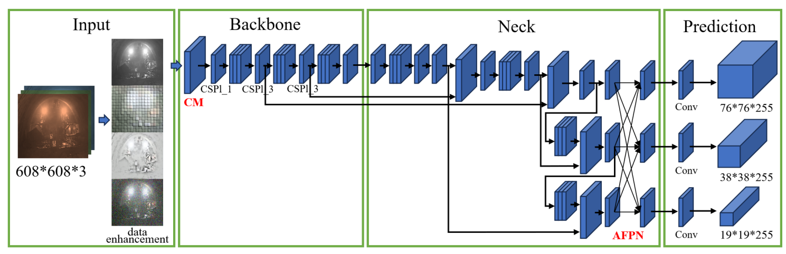
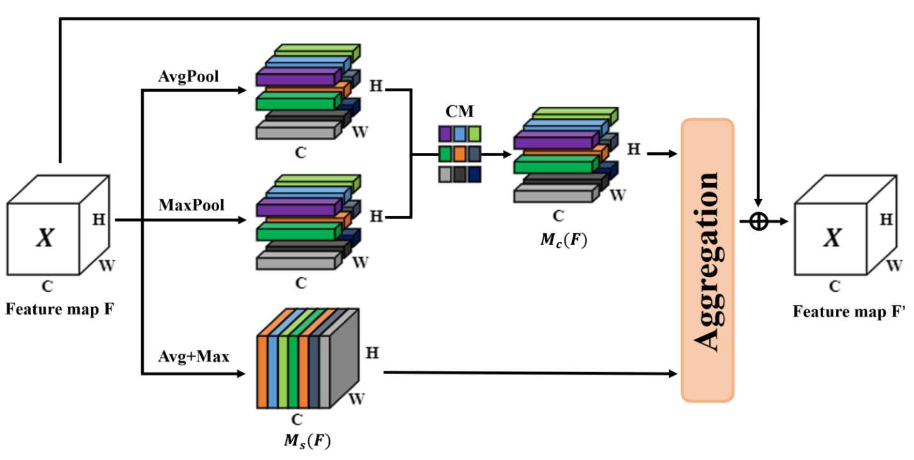
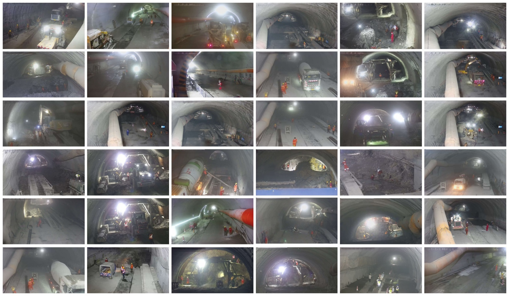
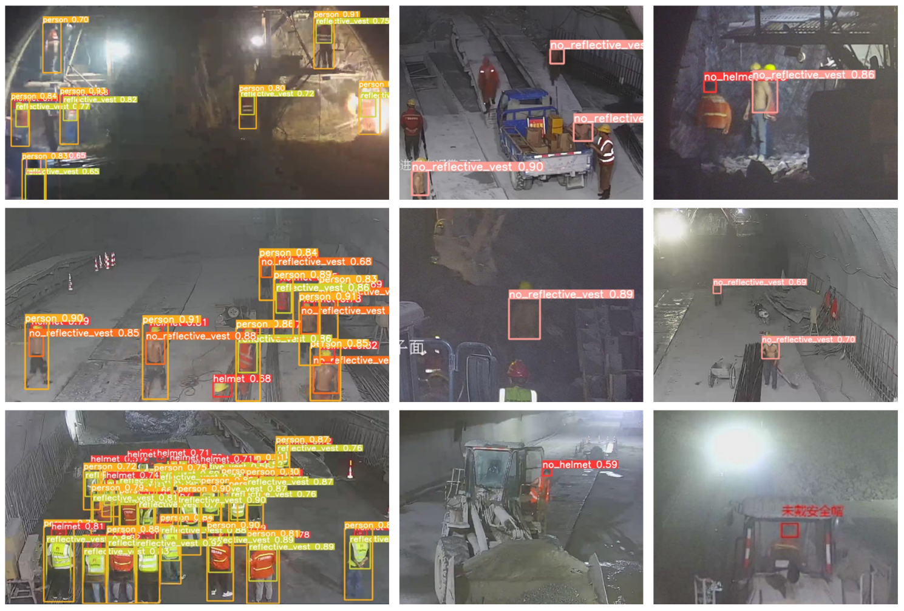
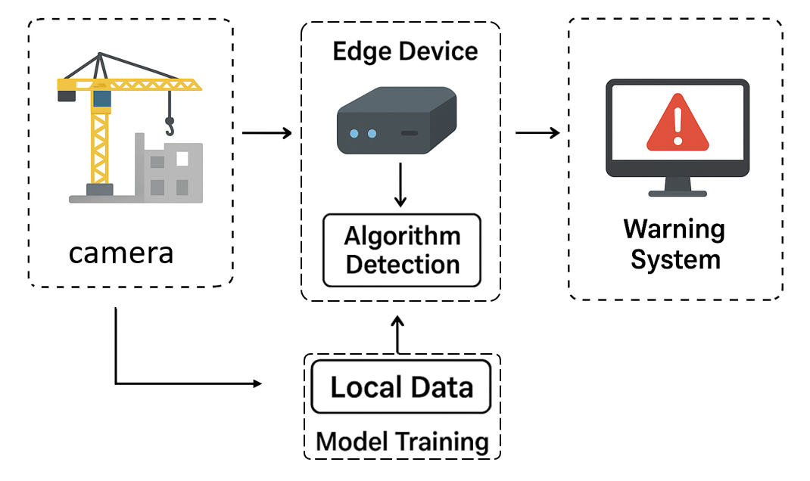
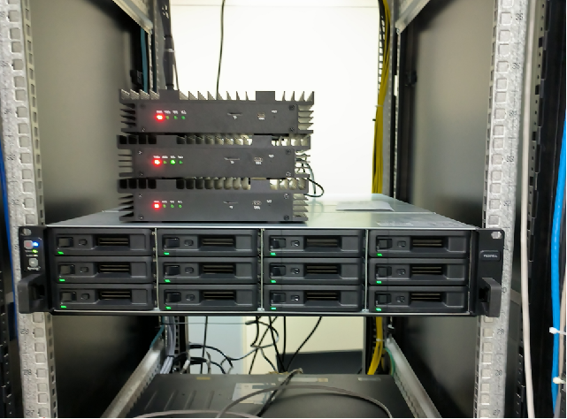

# Enhanced PPE Detection in Low-Light Tunnel Environments: A YOLOv5-Based Approach

## 1. Introduction

Addressing the challenges of personal protective equipment (PPE) detection in low-light tunnel environments, this paper introduces an improved YOLOv5-based method. The approach integrates a Channel-Metric (CM) attention mechanism, an Adaptive Feature Pyramid Network (AFPN), and an XIoU_NMS function to enhance detection robustness, small target detection, and occluded target detection. Experimental results demonstrate significant improvements, with a detection accuracy of 94.6% and a 15% increase in small target recall. The model's stable performance in real tunnel monitoring systems underscores its potential for enhancing construction safety management.

---

## 2. Requirements

### 2.1 Hardware Requirements
- GPU: NVIDIA RTX 4090 (20GB) or equivalent  
- CPU: Intel i9 or higher  
- RAM: ≥ 32GB  

### 2.2 Software Requirements
- OS: Ubuntu 20.04 / Windows 10  
- CUDA: 11.3  
- cuDNN: 8.2  

### 2.3 Python Dependencies
```bash
conda create -n ppe_yolov5 python=3.8 -y
conda activate ppe_yolov5
pip install -r requirements.txt
````

---

## 3. Core components

### 3.1 CM Attention Module

```python
class CM_Attention(nn.Module):
    def __init__(self, channels):
        super(CM_Attention, self).__init__()
        self.avg_pool = nn.AdaptiveAvgPool2d(1)
        self.fc = nn.Sequential(
            nn.Linear(channels, channels // 16, bias=False),
            nn.ReLU(inplace=True),
            nn.Linear(channels // 16, channels, bias=False),
            nn.Sigmoid()
        )

    def forward(self, x):
        b, c, _, _ = x.size()
        y = self.avg_pool(x).view(b, c)
        y = self.fc(y).view(b, c, 1, 1)
        return x * y.expand_as(x)
```


### 3.2 AFPN

The AFPN structure is defined in the `afpn.yaml` configuration file. Running `afpn.py` will instantiate and execute the model:

```bash
# Load configuration and run AFPN
python afpn.py --cfg afpn.yaml
```


### 3.3 XIoU\_NMS Function

Add the `bbox_iou_xiou` function to the `metrics. py` file
```python
def bbox_iou_xiou(box1, box2, x1y1x2y2=True, GIoU=False, DIoU=False, CIoU=False, XIoU=False, eps=1e-7):
    # Returns the IoU of box1 to box2. box1 is 4, box2 is nx4
    box2 = box2.T

    # Get the coordinates of bounding boxes
    if x1y1x2y2:  # x1, y1, x2, y2 = box1
        b1_x1, b1_y1, b1_x2, b1_y2 = box1[0], box1[1], box1[2], box1[3]
        b2_x1, b2_y1, b2_x2, b2_y2 = box2[0], box2[1], box2[2], box2[3]
    else:  # transform from xywh to xyxy
        b1_x1, b1_x2 = box1[0] - box1[2] / 2, box1[0] + box1[2] / 2
        b1_y1, b1_y2 = box1[1] - box1[3] / 2, box1[1] + box1[3] / 2
        b2_x1, b2_x2 = box2[0] - box2[2] / 2, box2[0] + box2[2] / 2
        b2_y1, b2_y2 = box2[1] - box2[3] / 2, box2[1] + box2[3] / 2

    # Intersection area
    inter = (torch.min(b1_x2, b2_x2) - torch.max(b1_x1, b2_x1)).clamp(0) * \
            (torch.min(b1_y2, b2_y2) - torch.max(b1_y1, b2_y1)).clamp(0)

    # Union Area
    w1, h1 = b1_x2 - b1_x1, b1_y2 - b1_y1 + eps
    w2, h2 = b2_x2 - b2_x1, b2_y2 - b2_y1 + eps
    union = w1 * h1 + w2 * h2 - inter + eps

    iou = inter / union
    if CIoU or DIoU or GIoU or XIoU:
        cw = torch.max(b1_x2, b2_x2) - torch.min(b1_x1, b2_x1)  # convex (smallest enclosing box) width
        ch = torch.max(b1_y2, b2_y2) - torch.min(b1_y1, b2_y1)  # convex height
        if CIoU or DIoU:  # Distance or Complete IoU https://arxiv.org/abs/1911.08287v1
            c2 = cw ** 2 + ch ** 2 + eps  # convex diagonal squared
            rho2 = ((b2_x1 + b2_x2 - b1_x1 - b1_x2) ** 2 +
                    (b2_y1 + b2_y2 - b1_y1 - b1_y2) ** 2) / 4  # center distance squared
            if CIoU:  
                v = (4 / math.pi ** 2) * torch.pow(torch.atan(w2 / h2) - torch.atan(w1 / h1), 2)
                with torch.no_grad():
                    alpha = v / (v - iou + (1 + eps))
                return iou - (rho2 / c2 + v * alpha)  # CIoU
            return iou - rho2 / c2  # DIoU
            # 这部分是新增的
        elif XIoU:
            c2 = cw ** 2 + ch ** 2 + eps  # convex diagonal squared
            rho2 = ((b2_x1 + b2_x2 - b1_x1 - b1_x2) ** 2 + (b2_y1 + b2_y2 - b1_y1 - b1_y2) ** 2) / 4  # center dist ** 2
            beta = 1
            q2 = (1 + torch.exp(-(w2 / h2)))
            q1 = (1 + torch.exp(-(w1 / h1)))
            v = torch.pow(1 / q2 - 1 / q1, 2)
            with torch.no_grad():
                alpha = v / (v - iou + (1 + eps)) * beta
            return iou - (rho2 / c2 + v * alpha)   
        c_area = cw * ch + eps  # convex area
        return iou - (c_area - union) / c_area  # GIoU https://arxiv.org/pdf/1902.09630.pdf
    return iou  # IoU
```
Modification:
```python
iou = bbox_iou(pbox.T, tbox[i], x1y1x2y2=False, CIoU=True)
i = torchvision.ops.nms(boxes, scores, iou_thres)
#Change to:
iou = bbox_iou_xiou(pbox.T, tbox[i], x1y1x2y2=False, XIoU=True)
i = NMS(boxes, scores, iou_thres, class_nms='XIoU') 
```

---

## 4. Experiments

### 4.1 Dataset

The dataset comprises 9,450 images across five categories: helmet, no_helmet, reflective_vests, no_reflective_vests, person. Safety helmets and reflective vests are essential protective equipment for workers, while the "people" category can be combined with the detection results of safety helmets and reflective vests to determine whether workers are wearing the necessary personal protective equipment.


Dataset Access: Due to its size and usage agreements, this dataset is not directly included in the repository. For research purposes, please contact us to request access to the dataset. Email:wumenglan_1998@126.com

### 4.2 training
Run the following command：
```python
python train.py --weights '' --cfg models/yolov5x-cm.yaml --data data/V005.yaml --hyp data/hyps/hyp.scratch.yaml --epochs 50 --batch-size 4 --imgsz 1280
```

### 4.2 Results



---
## 5. Application Deployment
### 5.1 deployment architecture


### 5.2 Edge device Requirements
Here is the hardware specification for the SY-E176 edge device in English Markdown format. You can use this directly in your GitHub documentation.

---
### **Edge Device Hardware Specifications (SY-E176)**
| Specification | Details |
| :--- | :--- |
| **Model** | SY-E176 |
| **Processor (SoC)** | 8 * ARM Cortex-A53 |
| **AI Performance** | 17.6 TOPS @ INT8 |
| **Memory** | LPDDR4 12 Gbyte |
| **Storage** | eMMC 32 Gbyte |
| **Network Interfaces** | 10/100/1000Mbps Adaptive Ethernet Port * 2 |
| **Video Decoding** | 32-channel 1080P @ 30fps (H.264, H.265)<br>16-channel 1080P @ 30fps (H.264, H.265) |
| **Video Encoding** | 480fps @ FHD (JPEG) |
| **Power Supply** | DC 12V/2A |
| **Operating Temperature** | -40°C ~ 70°C |
| **Power Consumption** | 14W |
| **Cooling** | Fanless heat conduction design (Passive cooling) |
| **Expansion** | Optional mSATA card interface, Wi-Fi, and 5G modules |

## 5. Statement

This repository is directly associated with our paper submitted to *The Visual Computer* journal.  
We kindly ask readers to cite our paper when using this code in academic research or applications.  

---


